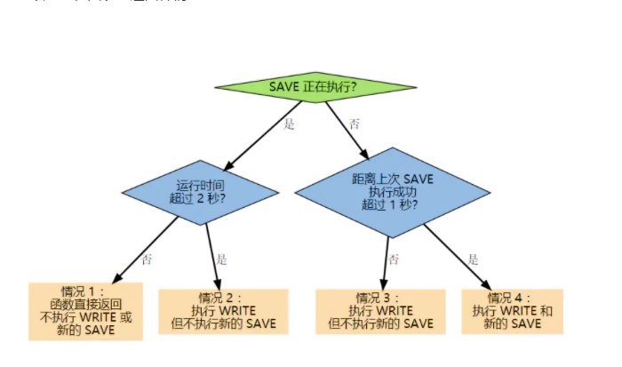

# Redis 数据持久化
https://www.jianshu.com/p/1e34fdc51e3b
+ AOF(Append Only File)
    + AOF持久化功能的实现可以分为命令追加、文件写入、文件同步三个步骤。
        + 命令追加：
            + 当AOF持久化功能打开时，服务器在执行完一个写命令之后，会以协议格式将被执行的写命令追加到服务器状态的aof_buf缓冲区的末尾。
            
        + AOF文件的写入与同步：
            + 每当服务器常规任务函数被执行、 或者事件处理器被执行时， aof.c/flushAppendOnlyFile 函数都会被调用， 这个函数执行以下两个工作：
              WRITE：根据条件，将 aof_buf 中的缓存写入到 AOF 文件。

              SAVE：根据条件，调用 fsync 或 fdatasync 函数，将 AOF 文件保存到磁盘中。
              
              两个步骤都需要根据一定的条件来执行， 而这些条件由 AOF 所使用的保存模式来决定。
              
              Redis 目前支持三种 AOF 保存模式，它们分别是：
              
                + AOF_FSYNC_NO ：不保存。
              
                    + 在这种模式下， 每次调用 flushAppendOnlyFile 函数， WRITE 都会被执行， 但 SAVE 会被略过。
                  
                  在这种模式下， SAVE 只会在以下任意一种情况中被执行：
                  
                  Redis 被关闭
                  
                  AOF 功能被关闭
                  
                  系统的写缓存被刷新（可能是缓存已经被写满，或者定期保存操作被执行）
                  
                  这三种情况下的 SAVE 操作都会引起 Redis 主进程阻塞。
              
                + AOF_FSYNC_EVERYSEC ：每一秒钟保存一次。
              
                    + 在这种模式中， SAVE 原则上每隔一秒钟就会执行一次， 因为 SAVE 操作是由后台子线程调用的， 所以它不会引起服务器主进程阻塞。
                  
                      注意， 在上一句的说明里面使用了词语“原则上”， 在实际运行中， 程序在这种模式下对 fsync 或 fdatasync 的调用并不是每秒一次， 它和调用 flushAppendOnlyFile 函数时 Redis 所处的状态有关。
                      
                      每当 flushAppendOnlyFile 函数被调用时， 可能会出现以下四种情况：
                      
                      子线程正在执行 SAVE ，并且：
                      
                      这个 SAVE 的执行时间未超过 2 秒，那么程序直接返回，并不执行 WRITE 或新的 SAVE 。
                      
                      这个 SAVE 已经执行超过 2 秒，那么程序执行 WRITE ，但不执行新的 SAVE 。注意，因为这时 WRITE 的写入必须等待子线程先完成（旧的） SAVE ，因此这里 WRITE 会比平时阻塞更长时间。
                      
                      子线程没有在执行 SAVE ，并且：
                      
                      上次成功执行 SAVE 距今不超过 1 秒，那么程序执行 WRITE ，但不执行 SAVE 。
                      
                      上次成功执行 SAVE 距今已经超过 1 秒，那么程序执行 WRITE 和 SAVE 。
                      
                      可以用流程图表示这四种情况：
                      
                    
                    
                    根据以上说明可以知道， 在“每一秒钟保存一次”模式下， 如果在情况 1 中发生故障停机， 那么用户最多损失小于 2 秒内所产生的所有数据。
                    
                    如果在情况 2 中发生故障停机， 那么用户损失的数据是可以超过 2 秒的。
                    
                    Redis 官网上所说的， AOF 在“每一秒钟保存一次”时发生故障， 只丢失 1 秒钟数据的说法， 实际上并不准确。
              
              + AOF_FSYNC_ALWAYS ：每执行一个命令保存一次。

                 + 在这种模式下，每次执行完一个命令之后， WRITE 和 SAVE 都会被执行。
                   
                   另外，因为 SAVE 是由 Redis 主进程执行的，所以在 SAVE 执行期间，主进程会被阻塞，不能接受命令请求。
                   
           